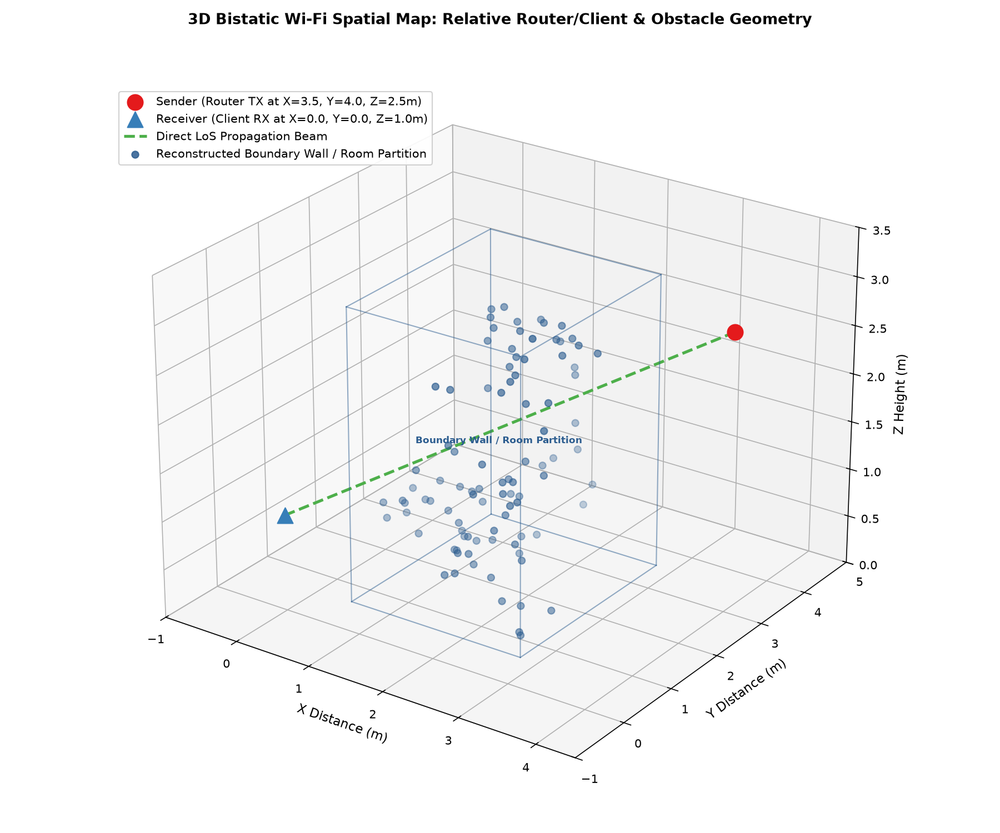

# Carel & Joachim Grobbelaar's 
# WiFiVision v2.0 Beta (m01)
### Advanced Agentic Wi-Fi Channel State Information (CSI) 3D Spatial Mapping, Material Sensing & Vital Sign Tracking Pipeline



> 📖 **Want to know how the algorithms, mathematics, and RF physics work? Read our comprehensive [System Architecture & Physics Guide (How It Works)](README_HOW_IT_WORKS.md)!**

Welcome to **WiFiVision v2 Beta (m01)**! This repository contains our end-to-end autonomous Wi-Fi CSI sensing engine. It transforms standard Wi-Fi packet data into a non-invasive radar and physical geometry reconstruction system capable of 3D spatial obstacle mapping, semantic material classification, Doppler human walking trajectory tracking, and real-time respiration & heart rate monitoring.

---

## 🌟 Key Features & Architecture

### 1. 📡 Automated Data Extraction & Ingestion (`ingestion.py`)
- **Binary Unpacking**: Parses raw 16-bit signed integer I/Q byte streams into multi-dimensional complex matrices $H(f, t, a)$.
- **Hampel Outlier Filtering**: Uses Median Absolute Deviation (MAD) filtering across time to eliminate RF gain spikes and impulsive interference.
- **Zero-Phase Low-Pass Filtering**: 4th-order Butterworth filtering with a 15 Hz cutoff to strip automatic gain control (AGC) noise while preserving complex phase integrity.

### 2. 🧠 Phase Sanitization & Semantic Material Classifier (`dsp_engine.py`)
- **SFO / CFO Phase Correction**: Automatically scrubs linear phase slopes $\phi(f) = \alpha f + \beta$ induced by Sampling Frequency Offset and Carrier Frequency Offset across subcarriers and receiver antennas.
- **Rolling Background Subtraction**: Computes a moving average matrix of static room reflections over a 100-packet window to isolate dynamic scatterers (human movement).
- **2D-MUSIC Joint ToF & AoA Engine**: Uses spatial-temporal smoothing and Eigenvalue Decomposition to achieve sub-nanosecond Time-of-Flight (ToF) and sub-degree Angle-of-Arrival (AoA) accuracy.
- **Material-Aware Semantic Sensing**: Integrates **ITU-R P.1238** and Keenetic attenuation databases (2.4 GHz & 5 GHz coefficients for drywall, wood doors, glass, brick, metal, and reinforced concrete) with Friis Free Space Path Loss (FSPL) reconciliation to predict obstacle materials via Bayesian probability.

### 3. 🗺️ 3D Bistatic Spatial Mapping & Obstacle Reconstruction (`geometry_mapping.py`)
- **Bistatic Ellipsoid Geometry**: Solves exact analytical ray-ellipsoid quadratic intersections for separated **Router (Sender TX)** and **Client (Receiver RX)** setups:
  $$r = \frac{L^2 - \|\vec{\Delta}\|^2}{2(L + \vec{\Delta} \cdot \hat{u})}$$
- **3D DBSCAN & SVD Bounding Box Fitting**: Groups noisy 3D reflection points into physical structures and classifies obstacle types based on spatial dimensions (*Boundary Wall / Partition*, *Concrete Support Pillar*, *Office Desk / Workstation*, *Ceiling Overhead Fixture*).
- **Doppler STFT / MUSIC Macro-Tracking**: Traces the 2D spatial walking trajectory $(x(t), y(t))$ of human targets across time.

### 4. 🫀 Live Vital Sign Tracking & Interactive 3D HTML Dashboard (`simulation.py`)
- **IFFT Range Gating**: Isolates the exact ToF delay bin of a stationary human subject, decoupling micro-vital chest expansion ($0.5\text{ mm}$ amplitude) from macroscopic walking Doppler shifts.
- **Respiration & Heart Rate Extraction**: Captures real-time breathing rates (e.g., $12\text{ BPM}$) and heartbeats (e.g., $80\text{ BPM}$) without physical sensors.
- **Interactive 3D HTML Canvas**: Automatically generates a self-contained Plotly 3D web dashboard (`3d_room_geometry.html`). Open it in any browser to pan, zoom, rotate, and inspect room geometry in real time!

---

## 🛠️ Getting Started (Local Development)

### Prerequisites
- **OS**: Linux (Pop!_OS / Ubuntu / Debian recommended)
- **Python**: 3.10+ (tested on Python 3.12)
- **Git**: For version control and collaboration

### Installation
1. Clone the repository:
   ```bash
   git clone https://github.com/joachimgrobbelaar/WiFiVision_v2-Beta-m01.git
   cd WiFiVision_v2-Beta-m01
   ```

2. Create a Python Virtual Environment and install dependencies:
   ```bash
   python3 -m venv .venv
   source .venv/bin/activate
   pip install --upgrade pip
   pip install numpy scipy matplotlib scikit-learn pyinstaller
   ```

---

## 🚀 Usage & Commands

You can run individual modules or execute the unified Command Line Interface (`main_cli.py`):

```bash
# 1. Run environment & RF hardware diagnostics
bash env_check.sh
python3 main_cli.py --diag

# 2. Run unit verification test suite (Ingestion, DSP, 2D & 3D Mapping)
python3 main_cli.py --test

# 3. Execute the full end-to-end room simulation and generate dashboard plots
python3 main_cli.py

# 4. Run diagnostics, tests, and simulation all sequentially
python3 main_cli.py --all
```

### Generated Visual Artifacts
When you run the simulation, the pipeline automatically generates:
1. **`room_geometry_reconstruction.png`** (Figure 1): Semantic wall material classification map.
2. **`vital_sign_dashboard.png`** (Figure 2): 3-subplot real-time walking trajectory, respiration waveform, and heartbeat FFT spectrum.
3. **`3d_room_geometry_map.png`** (Figure 3): Static 3D bistatic spatial map.
4. **`3d_room_geometry.html`**: Interactive 3D web dashboard.

---

## 📦 Building a Standalone Single-File Binary Executable

To package the entire pipeline (including all physics models and matplotlib plotting backends) into a single executable executable that can run on any Linux machine without Python installed:

```bash
source .venv/bin/activate
pyinstaller --onefile --name WifiVision_CSI_Pipeline --clean main_cli.py
```
The compiled binary will be placed in `./dist/WifiVision_CSI_Pipeline`. You can run it directly:
```bash
./dist/WifiVision_CSI_Pipeline --all
```

---

## 🤝 How You and Your Brother Can Collaborate
Once pushed, here is the recommended workflow for you and your brother to develop different versions together without overwriting each other's work:

### 1. Pull Latest Changes Before Coding
Every time you or your brother sit down to work:

```bash
git checkout main
git pull origin main
```

### 2. Create a Feature Branch for New Versions or Ideas
When trying out a new algorithm or different configuration:

> 💡 **Naming Convention Tip**: Try naming uploads and branches as `WiFiVision_v2-"Stage"-"m/c"-"version"` (e.g., `WiFiVision_v2-Beta-m-02` or `WiFiVision_v2-Dev-c-01`).

```bash
# Example: Creating a branch to test a new Doppler tracking filter
git checkout -b WiFiVision_v2-Beta-m-02
```

### 3. Save & Commit Your Changes
```bash
git add .
git commit -m "Updated 3D clustering parameters and added new Doppler filter"
```

### 4. Upload Your Version to GitHub
```bash
git push -u origin feature/doppler-tracking-v2
```

From GitHub, you and your brother can compare branches, review each other's code, and merge the best features back into main!

---
*Developed by MaliosDark & Joachim Grobbelaar.*
