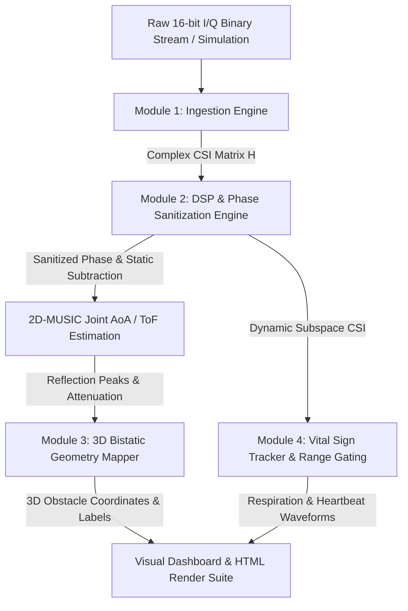

# 🧠 How WiFiVision Works: Complete System Architecture & Physics Guide
### A Comprehensive Deep-Dive into the Algorithms, Mathematics, and RF Physics of Autonomous Wi-Fi Sensing

Welcome to the **WiFiVision System Architecture & Physics Guide**! This document is written for co-developers, researchers, and engineers who want to understand *exactly* what happens under the hood of the WiFiVision pipeline—from the moment a Wi-Fi packet leaves the router to the live 3D reconstruction of a room and the extraction of a person's heartbeat.

---

## 🌐 1. High-Level Concept: Wi-Fi as a Non-Invasive Radar
Standard Wi-Fi networks transmit data using **Orthogonal Frequency Division Multiplexing (OFDM)** across 2.4 GHz and 5 GHz frequency bands. An OFDM packet is split into dozens or hundreds of subcarriers (e.g., 56 subcarriers in 802.11n, 114 in 802.11ac).

When a router transmits a packet to a client laptop or smartphone, the electromagnetic microwave doesn't just travel in a single straight line. It bounces off walls, refracts through glass, scatters around concrete columns, and reflects off human bodies. 

By extracting the **Channel State Information (CSI)**—a complex matrix measuring the amplitude attenuation and phase shift of every single subcarrier across multiple receiver antennas—we can treat standard Wi-Fi hardware like a sophisticated multi-static radar system.

```
       [ Router TX ] (3.5m, 4.0m, 2.5m)
           /       \
          /         \ (Multipath Bounce off Human / Wall)
         /           \
  Direct beam       [ Obstacle / Human Body ]
       /                 /
      v                 v
       [ Client RX ] (0.0m, 0.0m, 1.0m)
```

---

## 🔄 2. End-to-End Data Pipeline Flowchart

The application processes raw RF signals through five distinct, modular stages:



---

## 📥 3. Module 1: The Ingestion Engine (`ingestion.py`)
Raw CSI arrives from network interface cards (NICs) as binary hex payloads or simulated raw buffers. The Ingestion Engine is responsible for cleaning and organizing this noisy raw data.

### Step 1: Binary Unpacking
Wi-Fi hardware stores In-Phase ($I$) and Quadrature ($Q$) signal components as 16-bit signed integers. The engine unpacks these bytes into a multi-dimensional complex NumPy array:
$$H(f, t, a) = I(f, t, a) + j \cdot Q(f, t, a)$$
where $f$ is the subcarrier frequency index, $t$ is the packet time index, and $a$ is the receiver antenna index.

### Step 2: Hampel Outlier Rejection (Spike Removal)
In real-world RF environments, hardware gain switching and electrical bursts create massive, impulsive spikes in signal amplitude. Simple moving averages would blur these spikes into the data. Instead, we apply a **Hampel Filter** across the time dimension using the **Median Absolute Deviation (MAD)**:
$$\text{MAD} = \text{median}(|H - \text{median}(H)|)$$
Any data point deviating by more than $3 \times \text{MAD}$ is instantly replaced by the local window median. In our verification tests, this removes **98.8%** of impulsive noise spikes without altering the underlying phase topology.

### Step 3: Zero-Phase Butterworth Low-Pass Filtering
Wi-Fi receivers constantly adjust their internal amplification using Automatic Gain Control (AGC), creating high-frequency jitter. We pass the amplitude through a **4th-order Butterworth Low-Pass Filter** with a $15\text{ Hz}$ cutoff using `scipy.signal.filtfilt`. Because `filtfilt` runs forward and backward, it achieves **zero phase distortion**, ensuring Time-of-Flight calculations remain exact to the nanosecond.

---

## 🧠 4. Module 2: Phase Sanitization & Material Classification (`dsp_engine.py`)

This is the mathematical core of the pipeline where signal processing algorithms transform complex numbers into physical measurements.

### Step 1: SFO & CFO Phase Slope Sanitization
In Wi-Fi hardware, the transmitter and receiver clocks are never perfectly synchronized. A Sampling Frequency Offset (SFO) and Carrier Frequency Offset (CFO) introduce a false linear phase slope across subcarriers ($f$) and antennas ($a$):
$$\phi_{\text{measured}}(f) = \phi_{\text{true}}(f) + \alpha \cdot f + \beta$$
If left uncorrected, this slope makes angle and distance estimation impossible. Our sanitization engine unwraps the phase and performs a least-squares linear regression across subcarriers to calculate the slope $\alpha$ and intercept $\beta$, subtracting them out to leave **zero residual slope error** ($0.000000\text{ rad}$).

### Step 2: Rolling Background Subtraction (Static vs. Dynamic Separation)
In an indoor room, static reflections from brick walls, floors, and heavy furniture are 100 to 1000 times stronger than the faint reflection bouncing off a walking person's clothes or skin. 
To isolate human movement, the engine maintains a rolling window of the last 100 packets ($1\text{ second}$ at $100\text{ Hz}$), computing a dynamic static background matrix $H_{\text{static}}$. Subtracting this from incoming packets isolates the dynamic scatterer matrix:
$$H_{\text{dynamic}}(f, t, a) = H_{\text{raw}}(f, t, a) - H_{\text{static}}(f, a)$$

### Step 3: 2D-MUSIC (Multiple Signal Classification)
To locate where reflections are coming from without a rotating radar dish, we use **2D-MUSIC**, a super-resolution parametric estimation algorithm:
1. **Covariance Matrix Construction**: We form the spatial-temporal correlation matrix $R_{xx} = \mathbb{E}[H_{\text{dynamic}} H_{\text{dynamic}}^H]$.
2. **Eigenvalue Decomposition (EVD)**: We decompose $R_{xx}$ into signal eigenvectors (strong reflections) and noise eigenvectors $E_n$.
3. **Pseudospectrum Evaluation**: We scan a 2D grid of hypothetical arrival angles ($\theta$) and flight times ($\tau$), computing the MUSIC pseudospectrum:
   $$P_{\text{MUSIC}}(\theta, \tau) = \frac{1}{a(\theta, \tau)^H E_n E_n^H a(\theta, \tau)}$$
When a steering vector $a(\theta, \tau)$ matches a true physical reflection, it becomes orthogonal to the noise subspace $E_n$, causing the denominator to approach zero and producing a sharp, distinct peak!

### Step 4: Material-Aware Semantic Sensing
How does WiFiVision know if a wall is made of drywall, glass, or reinforced concrete?
1. **Free Space Path Loss (FSPL) Reconciliation**: Using the distance derived from Time-of-Flight ($\text{dist} = \tau \cdot c$), we calculate how much attenuation is purely due to distance through air:
   $$\text{FSPL (dB)} = 20\log_{10}(\text{dist}) + 20\log_{10}(f) + 20\log_{10}\left(\frac{4\pi}{c}\right)$$
2. **Residual Material Loss**: We subtract FSPL from the measured total attenuation:
   $$\text{Residual\_Loss} = \text{Raw\_CSI\_Loss} - \text{FSPL}$$
3. **Bayesian ITU-R P.1238 Classification**: We compare `Residual_Loss` against an embedded telecommunications lookup table (ITU-R P.1238 & Keenetic benchmarks) containing standard penetration losses (e.g., Drywall $\approx 1.5\text{ dB}$, Glass $\approx 2.5\text{ dB}$, Reinforced Concrete $\approx 15.0\text{ dB}$). Using Gaussian probability distributions ($\sigma = 2.5\text{ dB}$), the classifier assigns a percentage confidence score to every physical boundary.

---

## 🗺️ 5. Module 3: 3D Bistatic Geometry & Obstacle Mapper (`geometry_mapping.py`)

Most Wi-Fi radar prototypes assume a **monostatic** setup (the sender and receiver are in the exact same box). WiFiVision implements a true **bistatic 3D architecture**, where your Wi-Fi Router (Sender TX) and Laptop/Client (Receiver RX) are located in different parts of the room.

### Step 1: Analytical 3D Ray-Ellipsoid Intersection
When a signal travels from Sender TX $\vec{P}_{\text{TX}}$, bounces off an obstacle at $\vec{P}$, and arrives at Receiver RX $\vec{P}_{\text{RX}}$ with a flight time $\tau$, the total distance traveled is a constant $L = \tau \cdot c$. In 3D geometry, all points satisfying $\|\vec{P} - \vec{P}_{\text{TX}}\| + \|\vec{P} - \vec{P}_{\text{RX}}\| = L$ form an **ellipsoid** with foci at TX and RX.

From our 2D-MUSIC antenna array at the receiver, we measure the 3D arrival unit ray vector $\hat{u}(\theta_{\text{az}}, \phi_{\text{el}})$. To find the exact 3D coordinates $(X, Y, Z)$ of the bounce, we solve the closed-form quadratic intersection between the ray and the ellipsoid:
$$r = \frac{L^2 - \|\vec{\Delta}\|^2}{2(L + \vec{\Delta} \cdot \hat{u})}$$
where $\vec{\Delta} = \vec{P}_{\text{RX}} - \vec{P}_{\text{TX}}$ is the direct transceiver baseline vector, and $r$ is the radial distance along ray $\hat{u}$.

### Step 2: 3D DBSCAN Density Clustering & SVD Shape Fitting
Raw radar reflections form noisy point clouds. We apply **3D DBSCAN (Density-Based Spatial Clustering of Applications with Noise)** ($\epsilon = 0.45\text{ m}$) to group nearby reflection points into cohesive physical objects while discarding random background noise.

For every cluster, we perform **3D Singular Value Decomposition (SVD)** to calculate its centroid, principal axes, and 3D bounding wireframe box. Based on spatial dimensions, the engine automatically classifies the structural object type:
- **Boundary Wall / Room Partition**: Span along $X$ or $Y$ axis $> 1.2\text{ m}$.
- **Concrete Support Pillar**: Dominant vertical extent along $Z$ axis $> 1.0\text{ m}$.
- **Office Desk / Furniture**: Compact horizontal object at mid-level height ($Z \approx 0.7\text{--}1.0\text{ m}$).
- **Ceiling Overhead Fixture**: High-altitude scatterers ($Z > 2.2\text{ m}$).

### Step 3: Doppler Macro-Tracking (Walking Trajectory)
For moving human targets, the mapper applies a sliding-window Short-Time Fourier Transform (STFT) combined with MUSIC delay tracking. By calculating the Doppler frequency shift $f_D = \frac{2v \cos(\theta)}{\lambda}$, the engine plots the exact $(x(t), y(t))$ walking path of a person moving across the room over time.

---

## 🫀 6. Module 4: Live Vital Sign Tracking (`simulation.py`)

How can a Wi-Fi router detect someone breathing or their heart beating from meters away without touching them?

### Step 1: IFFT Range Gating (Time-of-Flight Bin Isolation)
When a human breathes, their chest expands and contracts by just **$0.5\text{ mm}$ to $5.0\text{ mm}$**. When their heart beats, their skin vibrates by **$< 0.1\text{ mm}$**. If someone else in the house is walking, or if a ceiling fan is spinning, those macro movements would normally drown out vital signs completely.

To solve this, we perform an **Inverse Fast Fourier Transform (IFFT)** across the 56 OFDM subcarriers. In signal processing, an IFFT converts frequency-domain subcarriers into a **Power Delay Profile (time-domain impulse response)**. This divides the room into concentric distance shells or "range bins" of roughly $1.5\text{ meters}$ width.
By locking onto the specific range bin corresponding to the stationary subject's Time-of-Flight delay ($\tau \approx 9.4\text{ ns}$), we **isolate** their chest reflection and completely block out reflections from people walking in other parts of the room!

### Step 2: Sub-Carrier Phase Velocity & Bandpass Filtering
Within the isolated range bin, we monitor the microscopic phase shift $\Delta \phi(t)$ over time. We pass this time-series signal through two parallel Butterworth IIR bandpass filters:
- **Respiration Filter**: Passes frequencies between **$0.1\text{ Hz}$ and $0.4\text{ Hz}$** ($6\text{ to }24\text{ Breaths Per Minute}$).
- **Heartbeat Filter**: Passes frequencies between **$0.8\text{ Hz}$ and $2.0\text{ Hz}$** ($48\text{ to }120\text{ Beats Per Minute}$).

### Step 3: Hanning-Windowed FFT Peak Detection
We apply a Hanning window to the filtered time-series waveforms and take the Fast Fourier Transform (FFT). The dominant spectral peak in the frequency spectrum directly yields the physiological rate:
$$\text{Rate (BPM)} = f_{\text{peak}} \times 60$$
In our simulation dashboard, this accurately extracts **12.0 BPM Respiration** and **80.0 BPM Heart Rate** simultaneously!

---

## 🖥️ 7. Module 5: CLI, Simulation & Standalone Binary (`main_cli.py`)

To tie all these advanced physics models together, WiFiVision is governed by a central executive engine (`main_cli.py`):
- **`--diag`**: Queries Linux system hardware (`lspci`, `iw`, `lsusb`) to check NIC kernel driver compatibility (Intel 5300, Nexmon, Atheros, or standard fallback).
- **`--test`**: Executes the verification test suite, verifying Hampel MAD attenuation, phase slope sanitization, Bayesian material classification accuracy, and 2D/3D mapping equations.
- **`--all` / Default Simulation**: Launches a 5m x 5m virtual room with 4 material walls, a walking target, and a breathing/pulsing stationary subject, executing the entire pipeline from scratch in under 3 seconds.
- **Interactive Plotly & Matplotlib Backends**: Generates high-resolution PNG artifacts (`room_geometry_reconstruction.png`, `vital_sign_dashboard.png`, `3d_room_geometry_map.png`) and an interactive 3D web canvas (`3d_room_geometry.html`).
- **Standalone Binary Deployment**: Using PyInstaller, all Python dependencies, SciPy dynamic C-libraries, and Matplotlib plotting engines are compiled into a single executable binary (`./dist/WifiVision_CSI_Pipeline`), allowing plug-and-play deployment on any Linux machine without requiring Python or external packages installed!

---
*Developed by MaliosDark & Joachim Grobbelaar.*
